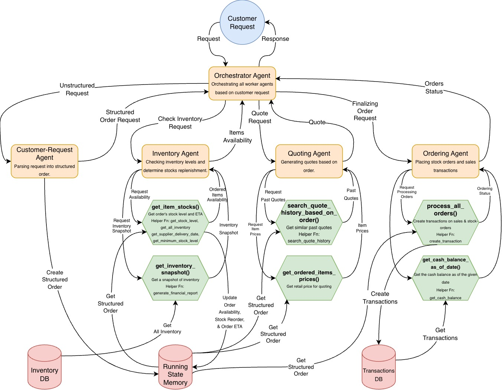

# Multi-Agent Sales AI-System Project Report

## Workflow

The system has five agents:
1. The Orchestrator
    An agent who accepts customer request and coordinating between the subagents
    fulfill the request.
2. The Customer-Request Agent
    An agent who is responsible for parsing the customer request into a structured
    order. This agent has no tool.
3. The Inventory Agent
    An agent who is responsible for getting the snapshot of the inventory for a
    given date, and checking the ordered items' stock levels, needs for reorder,
    and their estimated delivery-date for the reorders.

    This agent has two tools:
    1. `get_item_stocks`: for getting informations about ordered-item'stock levels, need for reorder, and reorder's ETA.
    2. `get_inventory_snapshot`: for getting the inventory snapshot for a given date.
4. The Quoting Agent
    An agent who is responsible for generating a quote for the requested order
    based on historical quotes of similar orders and the ordered-item prices.

    This agent has two tools:
    1. `search_quote_history_based_on_order`: getting past quotes that are similar to the requested order.
    2. `get_ordered_items_prices`: getting the retail prices (supplier-price + profit margin) for the ordered items.
5. The Ordering Agent
    An agent who is responsible for finalizing the requested orders by creating
    transaction-records for the sales and the stock-orders and assessing whether
    the current cash-balance is sufficient to order all of the stock-orders.

    This agent has two tools:
    1. `process_all_orders`: creating transactions for sales and stock-orders based on the requested orders and their needs for reordering, if any.
    2. `get_cash_balance_as_of_date`: getting the cash balance by querying the transaction DB for a given date.

## Evaluation Result
### Strengths
1. As observed from the result, the system can result in a partial or fully fulfilled order-request. This is beneficial as it does not wholly reject the entire order-request whenever there is an item that is not available and cannot be fulfilled.
2. As observed from the result, the system actively asks for confirmation to the user for its decision. This is beneficial as the system may decide to record some sales or stock-orders beforehand, and that action may not be to the customer's preference.
3. As observed from the result, the system is consistently able to change the cash balance. This shows that the tools for creating transactions, by sub-agents, is used effectively.

### Weakness
1. As observed from the result, the system may hallucinate about the quote number or the company sales-department's email, when it is not being provided of those informations.
2. As observed from the result and the implementation, the system still prematurely record sales transactions and stock-orders before customer's confirmation or payment. In a real life situation, this is an undesireable behavior as it is very prone to introduce mistakes.
3. As observed from the implementation, the system proceeds to commit orders even before checking whether the estimated delivery-dates of an item would exceed the expected event-date.

## Future Work
1. Improving prompts to reduce hallucinations about informations that are not given to the agents, especially regarding company contacts informations.
2. Modify the system to only record sales transactions or stock-orders whenever there is an explicit confirmation by the customer and/or proof of payment.
3. Modify the implementation so that it checks for requested-item's estimated delivery-dates before committing orders.
4. As observed from the results, the system independently decides what item to order when the request is ambiguous. For example, a request of "A4 Glossy Paper" may be quoted as an "A4 Paper" or "Glossy Paper" as both appears in the supplier's list. Even though sometimes it is good for the agent to resolve this issue, an even better behavior would be for it to follow-up on this ambiguity to the customer.
5. As observed from the implementation, the profit-margin is hard-coded. In future implementation, this should be done by the agent dynamically.
6. Improving multi-agent's interfacing by enforcing Pydantic's model format for their responses.